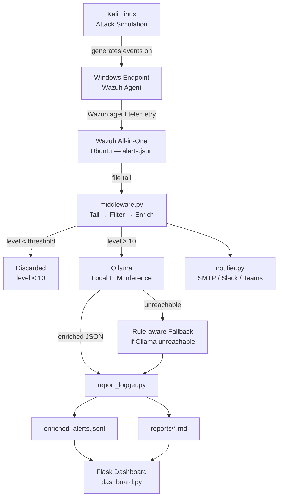

# AI-Enhanced SIEM 

> Wazuh tells you *what* happened. This tells you *what it means* — using a local LLM, with no data leaving your network.


---

## Table of Contents

1. [What This Is](#what-this-is)
2. [The Problem It's Solving](#the-problem-its-solving)
3. [What It Actually Does](#what-it-actually-does)
4. [Architecture](#architecture)
5. [Repository Structure](#repository-structure)
6. [How the Pipeline Works](#how-the-pipeline-works)
7. [Prerequisites](#prerequisites)
8. [Installation](#installation)
9. [Configuration](#configuration)
10. [Running It](#running-it)
11. [The Dashboard](#the-dashboard)
12. [Batch and Demo Mode](#batch-and-demo-mode)
13. [Testing](#testing)
14. [Security Design](#security-design)
15. [Example Output](#example-output)
16. [Honest Limitations](#honest-limitations)
17. [Where This Could Go Next](#where-this-could-go-next)
18. [Academic Context](#academic-context)
19. [Author](#author)
20. [License](#license)

---

## What This Is

This started as a B.Tech Cyber Security project and turned into something I'm actually proud of: a working pipeline that connects [Wazuh](https://wazuh.com/) to a locally running LLM through [Ollama](https://ollama.com/), and uses it to turn raw high-severity alerts into something an analyst can actually act on.

It's not a commercial product or a drop-in SOC replacement. It's a lab prototype built to answer a real question:

> *Can a locally running language model meaningfully reduce the cognitive load of first-pass alert triage, without sending sensitive log data to any external service?*

The answer, based on building and running this: yes — with real caveats that I've tried to be honest about throughout this README.

---

## The Problem It's Solving

If you've worked with a SIEM, you know what a raw alert looks like. Something like:

```
Rule: 5710 | Level: 12 | Agent: windows-endpoint | 192.168.1.45 | Jan 15 14:32:07 sshd[2341]: ...
```

That's it. The analyst on call at 3 AM receiving this alert still has to:

1. Remember or look up what rule 5710 actually means.
2. Figure out if this specific instance is a real threat or just noise.
3. Decide which systems are at risk and how urgently they need to respond.
4. Find the relevant remediation steps, probably from a runbook they haven't read since onboarding.

Multiply that by a hundred alerts a night and you get alert fatigue — analysts start tuning things out, and real incidents get missed.

This project adds a step between Wazuh and the analyst. A Python process watches `alerts.json`, catches high-severity events, sends them to a local LLM with a structured prompt, and stores the result alongside the original alert — a plain-English explanation of what happened, what's at risk, and what to do about it.

The LLM output is a **first-pass aide**, not a verdict. The analyst still makes the call. The goal is to cut out the lookup-and-context-assembly work so they can get to the decision faster.

---

## What It Actually Does

| Capability | Detail |
|---|---|
| Tails `alerts.json` in real time | Byte-offset tracking; handles partial writes and file rotation cleanly |
| Filters by Wazuh rule severity | Default: level ≥ 10; change it in `config.yaml` |
| Sends alerts to a local LLM | HTTP POST to Ollama; asks for structured JSON back |
| Structured enrichment output | Three fields every time: `explanation`, `impact`, `remediation` |
| Graceful fallback when Ollama is down | Rule-aware heuristic enrichment; the pipeline keeps running |
| SHA-256 alert fingerprinting | Dedup keyed on rule ID + source IP + raw log — not MD5 |
| JSONL audit trail | Append-only; one line per enriched alert |
| Markdown reports | One `.md` file per alert in `reports/`; content is escaped before write |
| Flask dashboard | Reads the full JSONL on each page load; counts stay accurate across restarts |
| Notification routing | SMTP / Slack / Teams, routed by rule ID or Wazuh group |
| Secrets via environment variables | Nothing sensitive needs to live in `config.yaml` |
| Batch mode | Feed it a JSONL file instead of a live Wazuh instance |
| Demo readiness check | `--demo-status` tells you if Wazuh and Ollama are both reachable before a presentation |
| Regression test suite | `pytest` covering fingerprinting, filtering, SSRF guards, and more |

---

## Architecture

### Data Flow



### The Lab Setup

Three VMs, all on a host-only network. The IPs below are just what's in the demo `config.yaml` — nothing is hardcoded in the logic.

```
┌──────────────────────────────────────────────────────┐
│  Lab Network (VMware / VirtualBox host-only)         │
│                                                      │
│  ┌──────────────────────┐   ┌──────────────────────┐ │
│  │  Ubuntu 22.04        │   │  Kali Linux          │ │
│  │  10.99.85.19         │   │  10.99.85.71         │ │
│  │                      │   │                      │ │
│  │  • Wazuh 4.x         │   │  • Ollama + model    │ │
│  │  • Python middleware │   │  • Attack tooling    │ │
│  │  • Flask dashboard   │   │    (nmap, hydra …)   │ │
│  └──────────┬───────────┘   └──────────────────────┘ │
│             │ Wazuh agent (port 1514)                │
│  ┌──────────▼───────────┐                            │
│  │  Windows 10/11       │                            │
│  │  Monitored endpoint  │                            │
│  └──────────────────────┘                            │
└──────────────────────────────────────────────────────┘
```

Ollama runs on the Kali VM deliberately — it keeps LLM inference off the Wazuh server, which is already doing enough work. If your setup is different, just point `ollama.base_url` at wherever Ollama is running.

---

## Repository Structure

```
SIEM/
├── src/
│   ├── main.py              # Entry point — --config, --batch, --demo-status
│   ├── middleware.py        # The core loop: tail, filter, enrich, dispatch
│   ├── ollama_service.py    # Talks to Ollama, builds prompts, parses responses
│   ├── models.py            # Alert and EnrichedAlert dataclasses
│   ├── notifier.py          # Sends to SMTP / Slack / Teams
│   ├── report_logger.py     # Writes JSONL and Markdown reports
│   ├── dashboard.py         # Flask dashboard
│   ├── config_loader.py     # Loads config.yaml, applies env var overrides
│   ├── config.yaml          # All runtime settings — don't commit real secrets
│   └── install.sh           # Sets up a systemd service on Ubuntu
│
├── reports/                 # Where enriched reports land (git-ignored)
├── tests/
│   └── test_core_hardening.py   # The regression suite
│
├── wazuh-training-set.jsonl     # Sample alerts for batch/demo mode
├── requirements.txt
├── .gitignore
└── README.md
```

---

## How the Pipeline Works

### Ingesting alerts

`middleware.py` tails `alerts.json` by tracking a byte offset into the file. Three things that would break a naive implementation are handled explicitly:

**Partial line writes.** Wazuh writes newline-delimited JSON, but `read()` doesn't guarantee you'll get a complete line. The tailer buffers incoming bytes until it sees a newline before trying to parse anything.

**File rotation.** When Wazuh rotates the alert file, the inode changes. The tailer catches this and reopens cleanly from the start of the new file rather than continuing to read a stale handle.

**Malformed JSON.** A bad line gets logged and skipped. It doesn't crash the loop or drop the alerts that follow it.

### Severity filtering

Wazuh levels go from 0 to 15. The middleware drops anything below the configured threshold (default: 10). Levels 10–11 are "high" by Wazuh convention, 12–14 are "critical", and 15 is reserved for internal Wazuh events. If you want to catch more (or fewer) alerts, adjust `severity_threshold` in `config.yaml`.

### LLM enrichment

`ollama_service.py` builds a prompt that includes the rule ID, description, agent name, source IP, and the raw log fragment. The model is asked to return a JSON object with exactly three keys. If it returns something malformed, the call retries once — after that, the fallback kicks in.

The fallback generates a deterministic response based on the Wazuh rule group (`syscheck`, `authentication_failed`, `web`, etc.). It's not as useful as a real LLM response, but it's honest about what it is: the JSONL record gets `"fallback": true` so you always know which output came from the model and which didn't.

### Fingerprinting

Early versions used MD5 to deduplicate alerts, but with a limited input set (just rule ID and timestamp) you'd get collisions — two alerts from different source IPs with the same rule ID would look like duplicates. The fingerprint now uses SHA-256 over the rule ID, source IP, full raw log string, and a minute-level timestamp. Different source, different record.

### Persistence

Every enriched alert does two things in `report_logger.py`:

1. Gets appended to `enriched_alerts.jsonl` as a single JSON line. This is the authoritative record — it's what the dashboard reads and what you'd hand to anyone doing incident analysis.
2. Gets its own Markdown file in `reports/`. All user-controlled strings go through an escaping function before write, so the output renders cleanly regardless of what the original log contained.

### Notifications

`notifier.py` checks each enriched alert against a routing table in `config.yaml`. You can route by rule ID or Wazuh group to any combination of SMTP, Slack, or Teams. If nothing matches, nothing is sent — there's no "send everything" fallback, which would get noisy fast. SMTP passwords are masked in the log output before the log call even happens.

---

## Prerequisites

| Dependency | Notes |
|---|---|
| Python 3.9+ | Tested on 3.10 and 3.11 |
| Wazuh 4.x | All-in-One on Ubuntu; needs to be writing `alerts.json` |
| Ollama | Any recent version; must be reachable over HTTP from the middleware host |
| LLM model | `llama3` for better output; `tinyllama` if you're on constrained hardware |
| Wazuh agent | On the endpoint you're monitoring |

The middleware doesn't need root. It needs read access to `alerts.json` (owned by `ossec` by default) and write access to `reports/`.

---

## Installation

### 1. Clone the repo

```bash
git clone https://github.com/vinayak-sriv/SIEM.git
cd SIEM
```

### 2. Install Python dependencies

```bash
python3 -m pip install -r requirements.txt
```

### 3. Set up Wazuh

Follow the [Wazuh All-in-One quickstart](https://documentation.wazuh.com/current/quickstart.html) for Ubuntu. Once it's running, check that alerts are actually being written:

```bash
sudo tail -f /var/ossec/logs/alerts/alerts.json
```

If the middleware user can't read that file, add them to the `ossec` group:

```bash
sudo usermod -aG ossec $USER
# Log out and back in, then check:
ls -la /var/ossec/logs/alerts/alerts.json
```

### 4. Install Ollama and pull a model

```bash
# Install Ollama
curl -fsSL https://ollama.com/install.sh | sh

# Pull a model — llama3 gives better output, tinyllama is faster on limited hardware
ollama pull llama3
ollama pull tinyllama   # optional lighter alternative

# Make sure the API is responding before you do anything else
curl http://localhost:11434/api/tags
```

### 5. (Optional) Run as a systemd service

```bash
sudo bash src/install.sh
sudo systemctl status siem-middleware
```

---

## Configuration

Everything lives in `src/config.yaml`:

```yaml
wazuh:
  alerts_file: /var/ossec/logs/alerts/alerts.json
  severity_threshold: 10          # Wazuh rule level 0–15; 10 is a reasonable starting point

ollama:
  base_url: http://127.0.0.1:11434  # Override with OLLAMA_URL
  model: tinyllama                   # Override with OLLAMA_MODEL
  timeout: 60

reports:
  output_dir: ./reports
  jsonl_file: ./reports/enriched_alerts.jsonl

dashboard:
  host: 127.0.0.1    # Keep this local; don't expose to 0.0.0.0 without a proxy and auth
  port: 5000
  token: ""          # Set via SIEM_DASHBOARD_TOKEN

notifications:
  smtp:
    host: smtp.gmail.com
    port: 587
    user: ""
    password: ""     # Set via SMTP_PASSWORD — please don't commit a real password here
    recipients: []
  slack:
    webhook_url: ""  # Set via SLACK_WEBHOOK; must start with https://
  teams:
    webhook_url: ""  # Set via TEAMS_WEBHOOK; must start with https://

routing:
  rules: []
  # Examples:
  #   - match: {rule_id: 5710}
  #     channel: slack
  #   - match: {group: authentication_failed}
  #     channel: smtp
```

### Keeping secrets out of the config file

Any field in the config can be overridden by an environment variable. Use a `.env` file (not committed) or a secrets manager:

```bash
export OLLAMA_URL=http://10.99.85.71:11434
export OLLAMA_MODEL=llama3
export SEVERITY_LEVEL=10
export SMTP_PASSWORD=your-app-password
export SLACK_WEBHOOK=https://hooks.slack.com/services/T.../B.../...
export TEAMS_WEBHOOK=https://outlook.office.com/webhook/...
export SIEM_DASHBOARD_TOKEN=local-dev-token
```

---

## Running It

### Check that everything's reachable first

Before a demo or the first run on a new machine, this command checks that `alerts.json` is readable and Ollama is responding:

```bash
python3 src/main.py --config src/config.yaml --demo-status
```

It's saved me from awkward silences in front of a projector more than once.

### Start the middleware

```bash
python3 src/main.py --config src/config.yaml
```

This blocks and tails the alert file until you stop it with `Ctrl+C`. If you installed the systemd service, use that instead for persistent operation.

### Start the dashboard

In a separate terminal:

```bash
python3 src/dashboard.py --config src/config.yaml --reports ./reports
```

Then open `http://127.0.0.1:5000`.

---

## The Dashboard

The Flask dashboard is intentionally simple and read-only. It reads `enriched_alerts.jsonl` on every page load and shows:

- A reverse-chronological feed of enriched alerts — rule ID, severity level, source IP, agent name, and the LLM explanation.
- A severity breakdown count, computed from the full JSONL file rather than in-memory state, so it stays accurate even if you've restarted the middleware.
- Links to each alert's individual Markdown report.

One thing worth noting: **the dashboard has no authentication**. It's a local inspection tool. Keep it bound to `127.0.0.1`. If you need it accessible on a network, put nginx or Caddy in front of it with basic auth.

---

## Batch and Demo Mode

If you don't have a live Wazuh instance running — maybe you're doing a demo, testing a change, or just evaluating this on a laptop — batch mode lets you run the full pipeline against a static JSONL file:

```bash
python3 src/main.py --batch wazuh-training-set.jsonl --config src/config.yaml
```

`wazuh-training-set.jsonl` is included in the repository. It's a curated set of representative high-severity Wazuh alerts — enough to show the enrichment working properly without needing to actually run a brute force attack. The output lands in the same `reports/` directory, and the dashboard renders it identically to live mode.

This mode was specifically added so the project could be demoed in a faculty review without any of the "sorry, let me just get this Kali box running" awkwardness.

---

## Testing

```bash
python3 -m pytest tests/ -v
```

The test suite in `tests/test_core_hardening.py` was written alongside the hardening work, not as an afterthought. Here's what it covers:

| Test area | What is checked |
|---|---|
| SHA-256 fingerprinting | Two alerts with the same rule ID but different source IPs produce different fingerprints |
| Fingerprint stability | The same alert always produces the same fingerprint |
| Collision resistance | Alerts that differ only in log content don't collide |
| Malformed JSON | A bad line doesn't raise or kill the loop; the next valid line is processed normally |
| SSRF guard | A private-range or loopback Ollama URL is rejected before any request goes out |
| Webhook validation | A non-HTTPS webhook URL is rejected at startup |
| Severity filtering | Alerts below the threshold never reach the enrichment stage |
| Markdown escaping | User-controlled strings are escaped in report output |
| Dashboard count accuracy | The alert count reflects the full JSONL file, not just what's in memory |

You don't need Ollama running to run the tests. Anything touching `ollama_service.py` either uses the fallback path or patches the HTTP call.

---

## Security Design

### Be honest about scope

This is a lab prototype. The controls below are real and tested. But this system hasn't been audited, and it's not ready for a production SOC without additional hardening. If you're using it in a real environment, treat it as a starting point, not a finished product.

### What's implemented

| Control | What's done and why |
|---|---|
| **Data locality** | All LLM inference goes through a local Ollama instance. Alert content never touches an external API. |
| **SHA-256 fingerprinting** | The old MD5-based approach used a narrow input set (rule ID + timestamp) and would collapse alerts from different source IPs into the same fingerprint. SHA-256 over rule ID + source IP + full raw log + truncated timestamp fixed that. |
| **SSRF protection on the Ollama URL** | `config_loader.py` validates `ollama.base_url` against RFC 1918 private ranges and loopback before any request is made. This stops the middleware from being used as a relay to probe other internal services. If you're running Ollama on a separate host in a split-network lab, there's a flag in `config_loader.py` to disable this check — it's documented in the code. |
| **Webhook HTTPS enforcement** | Slack and Teams URLs must begin with `https://`. HTTP URLs are rejected at config load time — if your webhook token is transmitted in plaintext, it's already compromised. |
| **SMTP credential masking** | The SMTP password is replaced with `***` before it's ever passed to a log statement. The raw value is never written to a log. |
| **Secrets via environment variables** | No secret field in `config.yaml` requires a real value. Everything resolves from environment variables at runtime, so you can use a secrets manager without any code changes. |
| **Rotating log files** | `RotatingFileHandler` puts a cap on log file size. Running for weeks without this would fill the disk. |
| **Partial-line buffering** | `json.loads()` is never called on a partial line. The tailer waits for a newline. |
| **Markdown escaping** | LLM output and alert-derived strings are escaped before write. Backtick injection in a crafted log line won't break the rendered report. |

### What's not protected — and you should know about it

**The dashboard has no login.** It's bound to `127.0.0.1` by default. Don't expose port 5000 on a network interface without putting a reverse proxy with auth in front of it.

**`config.yaml` file permissions matter.** If that file contains webhook URLs, anyone who can read it can trigger notifications to your Slack or Teams channels. Run `chmod 600 src/config.yaml`.

**Ollama has no access control by default.** Anyone who can reach port 11434 on the Ollama host can submit inference requests at your expense (compute-wise). Firewall it to the middleware host only.

**Prompt injection is a real surface.** A carefully crafted log line in a Wazuh alert could influence what the LLM says in its output. The Markdown escaping prevents rendering artifacts, but it doesn't sanitise the semantic content of the response. Analyst review is still necessary — don't automate actions off LLM output without a human in the loop.

---

## Example Output

Here's what an enriched alert looks like after the SSH brute force rule fires:

### JSONL record

```json
{
  "fingerprint": "a3f7c2d19e84b1056d2c7f3a...",
  "timestamp": "2025-01-15T14:32:07Z",
  "rule_id": 5710,
  "rule_level": 12,
  "description": "SSHD brute force attack",
  "source_ip": "192.168.1.45",
  "agent": "windows-endpoint",
  "enrichment": {
    "explanation": "Rule 5710 fires when Wazuh detects more than 8 failed SSH authentication attempts from a single source within a short window. The volume here — 12 failures in 40 seconds from 192.168.1.45 — is consistent with an automated credential-stuffing tool rather than a user mistyping a password.",
    "impact": "If any of the attempted credentials are valid, the attacker gains an interactive shell under the compromised account. From there: direct filesystem access, lateral movement via SSH agent forwarding or stored keys, and a persistent foothold if they append to ~/.ssh/authorized_keys.",
    "remediation": "1. Block 192.168.1.45 at the perimeter firewall and on-host via iptables/ufw. 2. Check /var/log/auth.log for any successful authentications from this IP. 3. Review ~/.ssh/authorized_keys on targeted accounts. 4. If compromise is suspected, lock the account (passwd -l) and rotate credentials. 5. Enforce key-only SSH auth (PasswordAuthentication no in sshd_config) and restart sshd."
  },
  "fallback": false
}
```

### Markdown report header

```markdown
# Alert — Rule 5710, Level 12

| Field       | Value                       |
|-------------|-----------------------------|
| Timestamp   | 2025-01-15T14:32:07Z        |
| Source IP   | 192.168.1.45                |
| Agent       | windows-endpoint            |
| Fingerprint | a3f7c2d19e84b105...         |
| Fallback    | No                          |

## Explanation
Rule 5710 fires when Wazuh detects more than 8 failed SSH authentication attempts…

## Impact
If any of the attempted credentials are valid, the attacker gains an interactive shell…

## Remediation
1. Block 192.168.1.45 at the perimeter firewall…
```

---

## Honest Limitations

I'd rather be upfront about where this falls short than have you discover it mid-demo.

**Enrichment quality depends heavily on the model.** `tinyllama` (1.1B parameters) is fast and returns valid JSON, but its analysis is often surface-level. `llama3` (8B) is meaningfully better. Neither has been fine-tuned on Wazuh data, so for unusual rule IDs the explanations can be vague. Always have an analyst review before taking action on enrichment output.

**There's no alert correlation.** Every alert is enriched in isolation. The pipeline has no memory, no session reconstruction, no concept of "these three alerts together mean something." A brute force, a successful login, and a privilege escalation will show up as three separate unrelated records. A real SOC tool would connect those dots.

**The deduplication window is minute-level.** A sustained brute force generating 500 identical alerts over 10 minutes produces ten records (one per minute boundary), not one. That's not ideal, but it's a deliberate tradeoff against missing genuinely distinct events.

**The dashboard is unauthenticated.** If this bothers you — and it should if you're thinking about anything beyond local use — it's not a hard problem to fix. Flask-Login or a simple token middleware would cover it.

**High alert volume will back up.** Enrichment throughput is bounded by Ollama's inference latency. There's no backpressure mechanism, so a flood of high-severity alerts will queue up. In the test lab this was never an issue, but it's worth knowing.

**Fallback enrichment is obviously fallback.** When Ollama is unreachable, the fallback generates something based on the Wazuh rule group. If the group is unrecognised, the output is a generic placeholder. It's better than crashing, but the dashboard makes it obvious which records are real enrichments and which are fallbacks.

---

## Where This Could Go Next

A few directions that seem worth pursuing if this ever becomes more than a lab project:

**Alert correlation** is the most impactful missing piece. Maintaining a sliding window of recent alerts per agent and looking for sequences that match known attack patterns (recon → credential attack → lateral movement) would make the enrichment dramatically more useful.

**MITRE ATT&CK tagging** is relatively low-hanging fruit — Wazuh's rule metadata already contains group names that map to ATT&CK techniques. Adding those tags to the JSONL record would make the output integrate more naturally with threat intelligence workflows.

**Wazuh REST API ingestion** would replace the file-tail approach and remove the `ossec` group permission dependency. It would also support multi-manager deployments, which file tailing fundamentally can't.

**A model evaluation harness** would let you run the batch dataset through multiple Ollama models and systematically compare enrichment depth, JSON parse success rate, and how often the model hallucinates rule explanations. That kind of benchmark would make model selection a data-driven decision.

**IP reputation lookup** before the LLM prompt — querying AbuseIPDB or VirusTotal for the source IP and including the reputation score in the context — would likely improve the quality of the impact and remediation output significantly.

---

## Academic Context

This was my B.Tech Cyber Security project at the **University of Petroleum and Energy Studies (UPES), Dehradun**. The goal was to build something real — a working system that touched SIEM deployment, log analysis, LLM integration, and secure system programming — rather than a simulation or a slide deck about what a system *would* do.

The lab was built from scratch: Wazuh All-in-One on Ubuntu, a Wazuh agent on a Windows endpoint, attack simulation from Kali Linux, and LLM inference running locally so there was no dependency on any paid API or external service. The `wazuh-training-set.jsonl`, `--batch` mode, and `--demo-status` command were added later specifically so the project could be demonstrated in a faculty review without needing the attack simulation to be actively running.

---

## Author

**Vinayak Srivastava**  
B.Tech Cyber Security, UPES Dehradun  
[github.com/vinayak-sriv](https://github.com/vinayak-sriv)

---

## License

Academic project. All rights reserved by the author.  
For reuse in research or education, open an issue or contact via GitHub.

---

*Wazuh · Ollama · Python · Flask*
